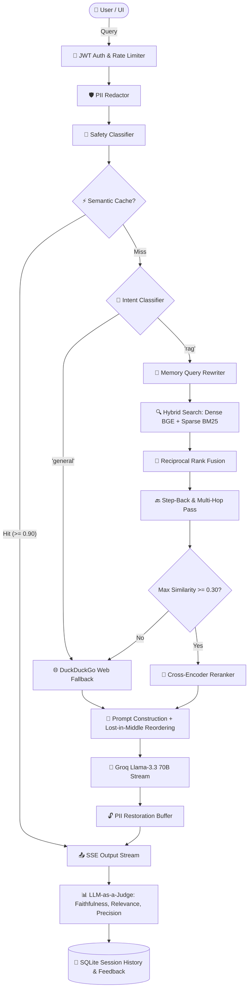

# 🤖 Enterprise Production-Grade RAG Assistant

An advanced, production-ready **Retrieval-Augmented Generation (RAG)** platform engineered with Python, FastAPI, Qdrant, FastEmbed, SQLite, Groq (Llama 3.3 70B), and Streamlit. Designed with a modular multi-tenant architecture, multi-stage retrieval, self-healing corrective web fallback, bi-directional PII redaction, token cost auditing, real-time LLM-as-a-Judge metrics, and developer telemetry.

---

## 📌 Table of Contents

- [Overview](#-overview)
- [Key Features](#-key-features)
- [Architecture & System Flow](#-architecture--system-flow)
- [Project Directory Structure](#-project-directory-structure)
- [Installation & Setup](#-installation--setup)
- [Usage Guide](#-usage-guide)
- [Detailed Technical Pipeline](#-detailed-technical-pipeline)
- [Security, Privacy & Multi-Tenancy](#-security-privacy--multi-tenancy)
- [Telemetry, Observability & Costs](#-telemetry-observability--costs)
- [Automated Evaluation & LLM-as-a-Judge](#-automated-evaluation--llm-as-a-judge)
- [Detailed Documentation](#-detailed-documentation)
- [License](#-license)

---

## 📖 Overview

Standard RAG implementations suffer from hallucination, context loss ("lost-in-the-middle"), security leaks, lack of evaluation, and dead-end responses when queries fall outside the document domain. 

This platform solves these challenges through an **Enterprise Production RAG Architecture**:
1. **Multi-Stage Hybrid Search**: Combines Dense (FastEmbed) + Sparse (BM25) search via Reciprocal Rank Fusion (RRF) with Cross-Encoder reranking and Lost-in-the-Middle chunk reordering.
2. **Corrective RAG (CRAG)**: Automatically detects when local document retrieval confidence is low ($<0.30$) or when queries have general intent, falling back seamlessly to DuckDuckGo live web search.
3. **Bi-Directional PII Shield**: Scrubs emails, phone numbers, and IP addresses before logging or sending to cloud APIs, while dynamically restoring PII in LLM prompts and user output streams.
4. **Local Resiliency**: Autonomously processes document ingestion using FastAPI `BackgroundTasks` when offline from Celery/Redis.
5. **Real-time LLM-as-a-Judge**: Continuously evaluates Faithfulness, Answer Relevance, and Context Precision per response with automatic hallucination warnings.

---

## ✨ Key Features

### 🧠 Advanced RAG & Retrieval
- **Paragraph-First & Parent-Child Chunking**: Preserves structural lists, code blocks, and paragraph continuity.
- **Hybrid RRF Search**: Merges vector similarity (FastEmbed `BAAI/bge-small-en-v1.5`) and lexical keywords (BM25).
- **MMR Diversification**: Eliminates redundant context chunks.
- **Cross-Encoder Reranking**: Re-scores top candidates using local transformer rerankers (`ms-marco-MiniLM-L-6-v2`).
- **Lost-in-the-Middle Re-ordering**: Places top-ranked context at prompt boundaries to prevent LLM context attenuation.
- **Step-Back Query Expansion & HyDE**: Generates abstract conceptual queries and hypothetical answers.
- **Multi-Hop Query Reasoning**: Performs automated multi-pass retrieval for comparative questions.
- **Corrective RAG (CRAG)**: Self-healing web fallback via DuckDuckGo (`ddgs`) when document similarity $<0.30$.

### 🛡️ Security, Privacy & Multi-Tenancy
- **Multi-Tenant JWT Auth**: Role-based access control (`admin`, `readonly`) with bcrypt password strength verification.
- **Payload Encryption at Rest**: Fernet AES-256 encryption on all stored chunk texts in Qdrant payloads.
- **Bi-Directional PII Scrubbing**: Masks sensitive PII for logs/tracing while safely restoring context for LLM generation and user output.
- **Input & Output Safety Guardrails**: LLM-powered classifier blocks jailbreaks, toxicity, and instruction overrides.

### ⚡ Performance & Telemetry
- **SQLite Semantic Cache**: Instant sub-100ms hits for cosine-similar queries ($\ge 0.90$).
- **Token Usage & API Cost Auditor**: Tracks cumulative query counts, token breakdowns, and estimated USD expenses in real-time.
- **Developer Telemetry**: Prometheus metrics endpoint (`/metrics`) and Arize Phoenix tracing integration.
- **Local Ingestion Fallback**: Asynchronous background ingestion fallback via FastAPI `BackgroundTasks`.

---

## 🏗️ Architecture & System Flow



---

## 📁 Project Directory Structure

```
rag_ai_assistant/
├── api/                   # REST API & FastAPI Routing Layer
│   ├── auth.py            # JWT authentication & password verification
│   ├── main.py            # FastAPI app initialization & CORS middleware
│   ├── middleware.py      # Rate limiting, correlation IDs, Prometheus metrics
│   └── routing.py         # RAG pipeline, CRAG fallback, token cost routes
├── database/              # Storage & Database Abstractions
│   ├── qdrant.py          # Qdrant client, collections, INT8 quantization
│   └── sqlite.py          # User DB, chat sessions, feedback, token logs
├── rag/                   # Core RAG Algorithms & Pipeline Modules
│   ├── chunking.py        # Paragraph-first & parent-child chunkers
│   ├── embedding.py       # FastEmbed models & SQLite embedding cache
│   ├── evaluation.py     # LLM-as-a-Judge (Faithfulness, Relevance, Precision)
│   ├── prompts.py         # Intent routing, query rewriter, step-back prompts
│   ├── reranking.py       # Local Cross-Encoder reranker & fallbacks
│   └── search.py          # Hybrid RRF search, BM25, MMR, semantic cache
├── security/              # Security & Guardrail Systems
│   ├── encryption.py      # Fernet AES-256 payload encryption at rest
│   ├── guardrails.py      # Input/output safety classifier
│   └── pii_redactor.py    # Bi-directional PII scrubbing & mapping
├── documentation/         # System Documentation & Technical Guides
│   ├── PROJECT_DEEP_DIVE.md # Comprehensive end-to-end technical guide
│   └── INTERVIEW_QA.md     # 30+ System Design & RAG Interview Q&As
├── docs/                  # Sample knowledge base documents for RAG indexing
├── app.py                 # Streamlit Frontend Application
├── tasks.py               # Celery worker task definitions
├── watcher.py             # Hot-reloading document directory watcher
├── requirements.txt       # Python dependencies
└── README.md              # Project overview (this document)
```

---

## 🛠️ Installation & Setup

### 1. Prerequisites
- Python 3.10+
- Groq API Key (Set in `.env`)

### 2. Environment Setup
```bash
git clone https://github.com/YATHARTHH/Rag_assistant.git
cd Rag_assistant

# Create virtual environment
python -m venv venv
.\venv\Scripts\activate   # Windows
# source venv/bin/activate # Linux/Mac

# Install dependencies
pip install -r requirements.txt
```

### 3. Environment Variables
Create a `.env` file in the root directory:
```env
GROQ_API_KEY=your_groq_api_key_here
SECRET_KEY=your_super_secret_jwt_key
QDRANT_PATH=./qdrant_db
```

### 4. Start Services

**Terminal 1: Start Backend API (FastAPI)**
```bash
python -m uvicorn api.main:app --host 127.0.0.1 --port 8000
```

**Terminal 2: Start Frontend UI (Streamlit)**
```bash
streamlit run app.py
```

Open your browser at **`http://localhost:8501`**.

---

## 📱 Usage Guide

1. **Authentication**: Register an account or log in with your credentials on the Streamlit sidebar.
2. **Document Manager**: Upload `.pdf`, `.txt`, `.docx`, `.csv`, or `.json` files via the drag-and-drop uploader. The system will parse, chunk, encrypt, and index the content into Qdrant.
3. **Chatting**: Ask questions in the **💬 Chat** tab. The UI displays:
   - Route tags (`⚡ Route: RAG Retrieval`, `⚡ Route: Corrective Web Search`, etc.)
   - File filters
   - Collapsible Grounding Sources with page numbers & similarity scores
   - Real-time hallucination warning banners if faithfulness $< 0.70$
   - 👍 / 👎 Feedback collection buttons
4. **Token Cost Auditor**: Monitor cumulative prompt/completion tokens and estimated USD costs in the sidebar.
5. **Evaluation Dashboard**: Switch to the **📊 Evaluation Dashboard** tab to view metric averages (Faithfulness, Answer Relevance, Context Precision), trend charts, and detailed evaluation logs over time.

---

## 🔐 Security, Privacy & Multi-Tenancy

- **Data Isolation**: All vector payloads and SQLite records are isolated by tenant (`user_id`). Users can only search or delete their own documents.
- **AES-256 Encryption at Rest**: Document text stored in Qdrant payloads is encrypted using Fernet AES-256 keying and decrypted in-memory only during query processing.
- **Bi-Directional PII Redaction**: Sensitive patterns (email, phone, IPv4) are replaced with `redacted_*` tokens during logging and telemetry to prevent data leaks. The original PII is safely restored in the final response stream.

---

## 📊 Telemetry, Observability & Costs

- **Prometheus Metrics**: Access `/metrics` for real-time counters on query latencies, cache hit/miss rates, and active requests.
- **Arize Phoenix Tracing**: Visual open-telemetry tracing available on `http://localhost:6006`.
- **Token Cost Auditor**: Live breakdown of prompt tokens, completion tokens, query counts, and estimated costs based on Llama-3.3-70B pricing ($0.59 / $0.79 per million tokens).

---

## 📚 Detailed Documentation

For a deeper dive into the system design, code architecture, algorithms, and interview questions:
- 📖 **[Project Deep Dive Guide](documentation/PROJECT_DEEP_DIVE.md)** — Complete end-to-end breakdown with Mermaid diagrams, mathematical formulas, and module-by-module walkthroughs.
- 🎓 **[RAG System Design Interview Q&A](documentation/INTERVIEW_QA.md)** — 30+ comprehensive interview questions and answers covering vector DBs, quantization, RRF, CRAG, PII security, and LLM evaluation.

---

## 📄 License

This project is licensed under the MIT License — see the [LICENSE](LICENSE) file for details.

⭐ **If you found this project helpful, please give it a star on GitHub!**
