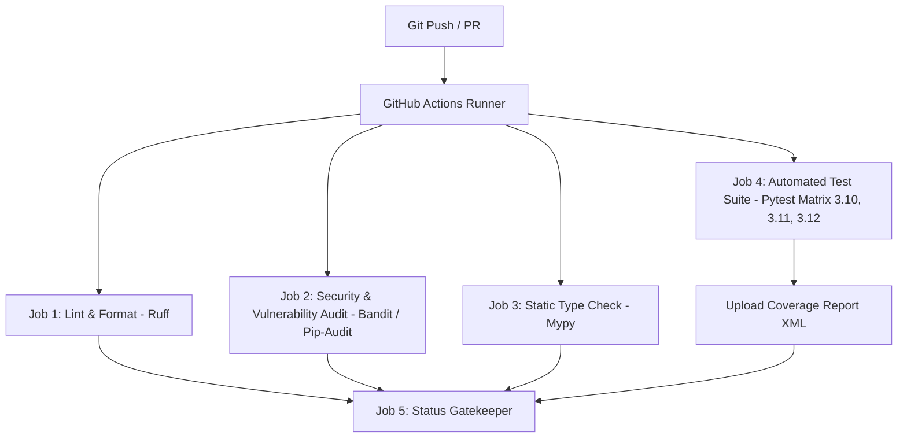

# Continuous Integration (CI) Documentation

This repository employs an enterprise-grade Continuous Integration (CI) pipeline using **GitHub Actions**, **Ruff**, **Pytest**, **Mypy**, **Bandit**, and **Pip-Audit**.

---

## 🛠️ Architecture & Pipeline Overview

The CI pipeline runs automatically on every `push` and `pull_request` targeting `main`, `master`, or `develop` branches.



---

## 🚀 Workflows Included

### 1. `ci.yml` (Main CI Pipeline)
- **Linting & Formatting**: Runs `ruff check .` and `ruff format --check .` to enforce PEP 8 style standards and code cleanliness.
- **Security Audit**: 
  - `bandit`: Static Application Security Testing (SAST) scanning for unsafe functions, weak crypto, or hardcoded credentials.
  - `pip-audit`: Scans third-party Python dependencies against known CVE databases.
- **Type Checking**: Runs `mypy` for static type analysis across core packages (`api/`, `security/`, `database/`, `rag/`).
- **Test Suite & Code Coverage**: Executes unit tests across Python `3.10`, `3.11`, and `3.12` using `pytest`. Generates coverage reports (`coverage.xml`).

### 2. `pr-hygiene.yml` (PR Security & Hygiene)
- **PR Title Validation**: Ensures PR titles follow Conventional Commits standard (`feat:`, `fix:`, `ci:`, etc.).
- **Secret Leak Detection**: Uses `gitleaks` to inspect commits for accidental API key or secret exposures.

---

## 💻 Local Pre-Push Checklist

Before pushing code to remote branches, developers should run the following commands locally:

```bash
# 1. Install development dependencies
pip install -r requirements-dev.txt

# 2. Code Linting & Formatting Check
ruff check .
ruff format --check .

# 3. Static Type Check
mypy api security database rag --ignore-missing-imports

# 4. Security SAST Scan
bandit -r api security database rag app.py -ll -ii

# 5. Run Automated Test Suite with Coverage
pytest --cov=api --cov=security --cov=database --cov=rag --cov-report=term-missing
```

---

## 🔒 Environment Variables & Secrets in CI

The CI test matrix injects synthetic, mock credentials (`GROQ_API_KEY`, `JWT_SECRET`) into test runners. Live external API calls are decoupled and mocked so that unit tests execute in under 10 seconds without consuming API credits or requiring external connectivity.
