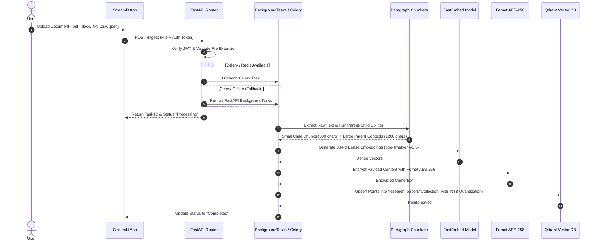
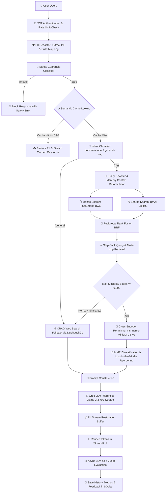
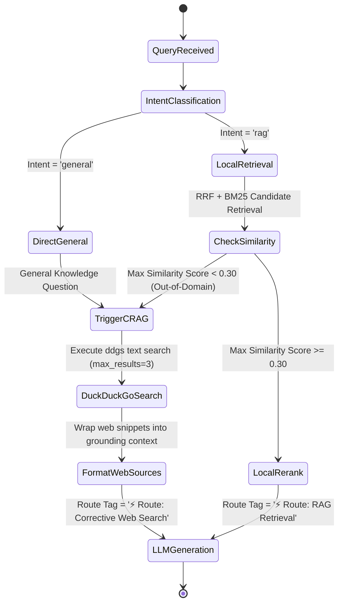
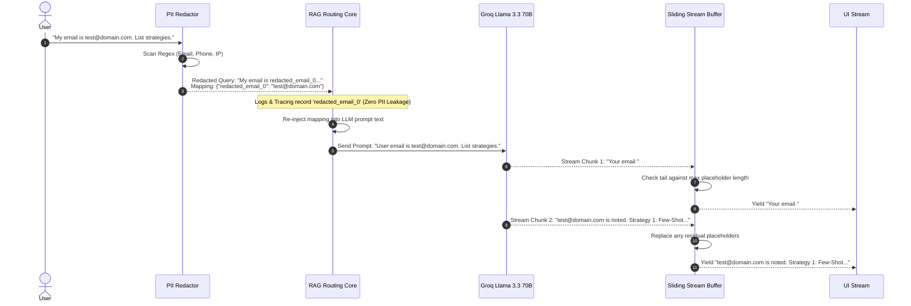

# 📘 Enterprise RAG Platform: Complete Technical Deep Dive

Welcome to the definitive technical deep-dive guide for the **Enterprise RAG Platform**. This document provides an exhaustive, beginner-to-advanced, start-to-end explanation of the entire system architecture, algorithms, data flows, security mechanisms, mathematical foundations, and code implementations.

---

## 📌 Table of Contents

1. [System Overview & Engineering Philosophy](#1-system-overview--engineering-philosophy)
2. [High-Level System Architecture](#2-high-level-system-architecture)
3. [End-to-End Execution Flows & Diagrams](#3-end-to-end-execution-flows--diagrams)
   - [Document Ingestion & Indexing Pipeline](#document-ingestion--indexing-pipeline)
   - [Query Processing & Multi-Stage Retrieval Pipeline](#query-processing--multi-stage-retrieval-pipeline)
   - [Corrective RAG (CRAG) Web Search Fallback](#corrective-rag-crag-web-search-fallback)
   - [Bi-Directional PII Scrubbing & Stream Restoration](#bi-directional-pii-scrubbing--stream-restoration)
4. [Module-by-Module Code Architecture](#4-module-by-module-code-architecture)
   - [`api/` — API Gateway & Routing](#api--api-gateway--routing)
   - [`database/` — Vector & Relational Storage](#database--vector--relational-storage)
   - [`rag/` — Retrieval, Reranking & Evaluation](#rag--retrieval-reranking--evaluation)
   - [`security/` — Encryption, Guardrails & PII](#security--encryption-guardrails--pii)
   - [`app.py` — Streamlit Frontend UI](#apppy--streamlit-frontend-ui)
5. [Deep Dive: Algorithms & Mathematical Foundations](#5-deep-dive-algorithms--mathematical-foundations)
   - [Paragraph-First & Parent-Child Chunking](#paragraph-first--parent-child-chunking)
   - [Reciprocal Rank Fusion (RRF)](#reciprocal-rank-fusion-rrf)
   - [BM25 Lexical Scoring](#bm25-lexical-scoring)
   - [Scalar Quantization (INT8) & HNSW Indexing](#scalar-quantization-int8--hnsw-indexing)
   - [Maximal Marginal Relevance (MMR)](#maximal-marginal-relevance-mmr)
   - [Cross-Encoder Reranking vs Bi-Encoders](#cross-encoder-reranking-vs-bi-encoders)
   - [Lost-in-the-Middle Chunk Re-ordering](#lost-in-the-middle-chunk-re-ordering)
   - [LLM-as-a-Judge Evaluation Metrics](#llm-as-a-judge-evaluation-metrics)
6. [Security, Multi-Tenancy & Data Privacy](#6-security-multi-tenancy--data-privacy)
7. [Observability, Telemetry & Cost Auditor](#7-observability-telemetry--cost-auditor)
8. [Conclusion & Production Deployment Checklist](#8-conclusion--production-deployment-checklist)

---

## 1. System Overview & Engineering Philosophy

### The Problem with Naive RAG
Naive RAG applications follow a simplistic workflow: 
$$\text{Document} \xrightarrow{\text{Fixed Split}} \text{Chunks} \xrightarrow{\text{Embed}} \text{Vector DB} \xrightarrow{\text{Top-K Cosine}} \text{LLM}$$

While simple to build, naive RAG fails in enterprise production due to five critical bottlenecks:
1. **Low Retrieval Precision & Recall**: Single-vector cosine similarity misses lexical keywords (acronyms, model names, IDs).
2. **Context Fragmentation**: Arbitrary character splitting cuts mid-sentence or breaks structured lists and tables across chunks.
3. **Lost-in-the-Middle Effect**: LLMs pay attention primarily to the beginning and end of their prompt context window, ignoring information placed in the middle.
4. **Dead-End Knowledge Boundaries**: When a user asks a question outside the document knowledge base, standard RAG returns unhelpful responses like *"I cannot find this in documents"*.
5. **Privacy & Security Vulnerabilities**: Document payloads sit unencrypted in vector databases, and user queries leak sensitive PII (emails, phone numbers) to cloud LLM vendors.

### The Solution: Production-Grade RAG
This platform implements an advanced **self-correcting, multi-stage RAG architecture** designed to solve every one of these failure modes locally:

- **Multi-Tenant Isolation**: JWT claims restrict document queries to authorized users.
- **Fernet AES-256 Payload Encryption**: All stored chunks are encrypted at rest in Qdrant payloads.
- **Bi-Directional PII Shield**: Scrubs emails, phone numbers, and IP addresses before logging or sending to APIs, then reconstructs and restores PII in the user's output stream.
- **Hybrid RRF Fusion**: Combines FastEmbed dense embeddings (`BAAI/bge-small-en-v1.5`) with BM25 sparse keyword scores using Reciprocal Rank Fusion.
- **Local Cross-Encoder Reranking**: Re-scores top candidates using `ms-marco-MiniLM-L-6-v2`.
- **Corrective RAG (CRAG)**: Detects when local document retrieval similarity is below $0.30$ or query intent is `general`, falling back automatically to DuckDuckGo (`ddgs`) live web search.
- **Token Usage & API Cost Auditor**: Tracks cumulative query counts, token counts, and calculates USD costs based on Llama-3.3-70B pricing.
- **Automated LLM-as-a-Judge Metrics**: Computes Faithfulness, Answer Relevance, and Context Precision per response in real-time, displaying hallucination warning banners when scores fall below $0.70$.

---

## 2. High-Level System Architecture

The platform follows a clean 4-tier modular layer:

```
+-----------------------------------------------------------------------+
|                         Streamlit Frontend UI                         |
|   (Chat Interface, File Manager, Token Cost Auditor, Eval Dashboard)  |
+-----------------------------------------------------------------------+
                                   | HTTP REST / SSE Stream
                                   v
+-----------------------------------------------------------------------+
|                           FastAPI API Layer                           |
|  (Auth JWT, Rate Limiting, Correlation ID, Prom Metrics, Routing)     |
+-----------------------------------------------------------------------+
            |                              |                   |
            v                              v                   v
+-----------------------+     +-----------------------+     +-----------+
|    Security Layer     |     |   Core RAG Pipeline   |     | Database  |
| - AES-256 Encryption  |     | - Chunking & Embed    |     | - Qdrant  |
| - PII Redactor Shield |     | - Hybrid RRF & BM25   |     |   Vector  |
| - Input/Output Safety |     | - Cross-Encoder       |     | - SQLite  |
+-----------------------+     | - CRAG Web Fallback   |     |   Relational
                              | - LLM-as-a-Judge Eval |     +-----------+
                              +-----------------------+
```

---

## 3. End-to-End Execution Flows & Diagrams

### Document Ingestion & Indexing Pipeline



---

### Query Processing & Multi-Stage Retrieval Pipeline



---

### Corrective RAG (CRAG) Web Search Fallback



---

### Bi-Directional PII Scrubbing & Stream Restoration



---

## 4. Module-by-Module Code Architecture

### `api/` — API Gateway & Routing

- **`api/main.py`**: Entry point for FastAPI. Configures CORS middleware, mounts sub-routers, initializes Prometheus metrics, and manages lifespan startup events.
- **`api/auth.py`**: Handles user registration, password strength validation (using regex for uppercase, numbers, special characters), password hashing via `bcrypt`, and JWT token issuance/verification (`PyJWT`).
- **`api/middleware.py`**: Implements Slowapi rate limiting (`10 requests/minute` per user), correlation-ID injection for every HTTP request, and latency metrics tracking.
- **`api/routing.py`**: The core orchestration file. Contains the `/chat`, `/ingest`, `/db/stats`, `/db/token_usage`, `/db/clear`, and `/chat/feedback` endpoints. Integrates multi-tenant checks, CRAG fallback logic, and SSE streaming.

### `database/` — Vector & Relational Storage

- **`database/qdrant.py`**: Establishes the Qdrant client connection (`./qdrant_db`). Defines collection parameters for `research_papers`:
  - **Vector Dimension**: `384` (matching `BAAI/bge-small-en-v1.5`)
  - **Distance Metric**: `Cosine`
  - **Scalar Quantization**: `INT8` (4x memory reduction)
  - **HNSW Index Config**: `m=16`, `ef_construct=100`
- **`database/sqlite.py`**: Manages the SQLite database (`users.db`). Contains tables:
  - `users`: ID, username, password hash, role (`admin`, `readonly`), created timestamp.
  - `chat_history`: ID, username, session ID, role (`user`, `assistant`), message content, timestamp.
  - `feedback`: ID, username, message ID, rating (`+1`, `-1`), text.
  - `token_usage`: ID, username, query, prompt tokens, completion tokens, total tokens, timestamp.
  - `embedding_cache`: Hash key, vector blob (caches FastEmbed calls).

### `rag/` — Retrieval, Reranking & Evaluation

- **`rag/chunking.py`**: 
  - `paragraph_first_chunking()`: Splits documents along `\n\n` boundaries before checking character thresholds.
  - `parent_child_chunking()`: Generates small child chunks (300 chars) for high-precision vector matching, linked to large parent contexts (1200 chars) returned to the LLM.
- **`rag/embedding.py`**: Lazily loads `FastEmbed` (`TextEmbedding("BAAI/bge-small-en-v1.5")`). Implements local SQLite caching for query embeddings.
- **`rag/search.py`**: 
  - `retrieve_context()`: Executes hybrid retrieval:
    1. Fetches top vector points from Qdrant.
    2. Builds local BM25 index over retrieved candidate pool.
    3. Merges ranks using RRF.
    4. Applies MMR diversification.
  - `check_semantic_cache()`: Queries SQLite semantic cache for cosine similarity $\ge 0.90$.
- **`rag/prompts.py`**: Contains system prompt templates, `classify_query_intent()`, `rewrite_query_with_history()`, `generate_stepback_query()`, and `detect_multi_hop_query()`.
- **`rag/reranking.py`**: Lazily loads `SentenceTransformerReranker` (`ms-marco-MiniLM-L-6-v2`). Includes an LLM-based fallback reranker.
- **`rag/evaluation.py`**: Implements LLM-as-a-Judge metric evaluators (`evaluate_faithfulness`, `evaluate_answer_relevance`, `evaluate_context_precision`).

### `security/` — Encryption, Guardrails & PII

- **`security/encryption.py`**: Uses Python `cryptography` library (`Fernet`) to generate AES-256 keys. Encrypts payload content before upserting into Qdrant and decrypts upon retrieval.
- **`security/guardrails.py`**: Calls LLM classifier to evaluate query inputs and generated outputs against safety policies (blocking jailbreaks, toxic speech, system prompt leaks).
- **`security/pii_redactor.py`**: Uses optimized regular expressions for Emails, Phone Numbers, and IPv4 addresses. Supports `return_mapping=True` to output a `(redacted_text, mapping_dict)` tuple.

### `app.py` — Streamlit Frontend UI

- Clean multi-page tab layout (`💬 Chat` and `📊 Evaluation Dashboard`).
- Authenticated session state persistence (`st.session_state.token`).
- Document file manager with chunk deletion capabilities.
- Live Grounding Sources drop-down with similarity scores and page numbers.
- Token Usage & API Cost Auditor in sidebar.
- Real-time metric trend line charts and evaluation logs table.

---

## 5. Deep Dive: Algorithms & Mathematical Foundations

### Paragraph-First & Parent-Child Chunking
Naive chunking splits text by fixed character counts (e.g. 500 characters), often cutting words or separating bulleted items from their heading. 

Our **Paragraph-First Chunking** algorithm works as follows:
1. Split document by double-newlines `\n\n` into logical paragraphs.
2. If a paragraph exceeds `chunk_size`, split it into sentences using punctuation boundaries (`.`, `!`, `?`).
3. Group paragraphs until `chunk_size` is reached, retaining an overlap of `chunk_overlap` characters.

**Parent-Child Chunking** creates two layers:
- **Child Chunks** ($300$ chars): Embedded and stored in Qdrant for fine-grained similarity matching.
- **Parent Chunks** ($1200$ chars): Stored in document metadata. When a child chunk matches a query, the **Parent Chunk** is retrieved and fed to the LLM, giving the model full surrounding context.

---

### Reciprocal Rank Fusion (RRF)
When combining dense vector retrieval (semantic search) and sparse BM25 retrieval (keyword search), raw similarity scores cannot be added directly because they exist on different scales. 

**Reciprocal Rank Fusion (RRF)** combines ranks instead of raw scores:

$$RRF\_Score(d \in D) = \sum_{m \in M} \frac{1}{k + r_m(d)}$$

Where:
- $M$: The set of retrieval systems (Dense Vector Search, Sparse BM25 Search).
- $r_m(d)$: The rank of document $d$ in retrieval system $m$ (1-indexed).
- $k$: A smoothing constant (default $k = 60$).

**Why $k = 60$?** The constant $k$ mitigates the impact of high ranks from a single system. A document ranked #1 in vector search gets $\frac{1}{60 + 1} = 0.01639$. A document ranked #1 in both vector and BM25 search gets $0.01639 + 0.01639 = 0.03278$, boosting it to the top.

---

### BM25 Lexical Scoring
Sparse retrieval uses the **BM25 (Best Matching 25)** algorithm to score document relevance based on exact term matches:

$$\text{Score}(D, Q) = \sum_{i=1}^{n} \text{IDF}(q_i) \cdot \frac{f(q_i, D) \cdot (k_1 + 1)}{f(q_i, D) + k_1 \cdot \left(1 - b + b \cdot \frac{|D|}{\text{avgdl}}\right)}$$

Where:
- $f(q_i, D)$: Term frequency of query word $q_i$ in document $D$.
- $|D|$: Length of document $D$ in words.
- $\text{avgdl}$: Average document length across the collection.
- $k_1 = 1.5$: Controls term frequency saturation.
- $b = 0.75$: Controls document length normalization.
- $\text{IDF}(q_i) = \ln \left( \frac{N - n(q_i) + 0.5}{n(q_i) + 0.5} + 1 \right)$, where $N$ is total document count and $n(q_i)$ is document frequency of term $q_i$.

---

### Scalar Quantization (INT8) & HNSW Indexing
Vector embeddings typically use 32-bit floating-point numbers (`FP32`), requiring $384 \times 4 \text{ bytes} = 1,536 \text{ bytes}$ per vector.

**Scalar Quantization (INT8)** maps continuous `FP32` values to discrete 8-bit integers (`0` to `255`):

$$q = \text{round}\left( \frac{v - v_{\min}}{v_{\max} - v_{\min}} \times 255 \right)$$

This reduces vector RAM footprint by **75%** ($384 \text{ bytes}$ per vector) with $<1\%$ loss in retrieval accuracy.

**HNSW (Hierarchical Navigable Small World)** indexes these vectors into multi-layer graphs:
- Upper layers contain sparse long-distance links for fast skip-list style traversal.
- Bottom layer contains dense local links for accurate nearest-neighbor search.
- Config parameters: `m=16` (connections per node), `ef_construct=100` (search depth during index construction).

---

### Maximal Marginal Relevance (MMR)
Vector retrieval often returns multiple chunks that express the exact same point. **Maximal Marginal Relevance (MMR)** balances query relevance with diversity to eliminate redundant chunks:

$$\text{MMR} = \arg\max_{d_i \in R \setminus S} \left[ \lambda \cdot \text{Sim}_1(d_i, Q) - (1 - \lambda) \max_{d_j \in S} \text{Sim}_2(d_i, d_j) \right]$$

Where:
- $R$: Candidate set of retrieved documents.
- $S$: Subset of documents already selected.
- $\text{Sim}_1$: Cosine similarity between candidate chunk $d_i$ and query $Q$.
- $\text{Sim}_2$: Cosine similarity between candidate chunk $d_i$ and already selected chunk $d_j$.
- $\lambda = 0.7$: Controls trade-off ($\lambda=1$ is pure relevance; $\lambda=0$ is pure diversity).

---

### Cross-Encoder Reranking vs Bi-Encoders
- **Bi-Encoder (FastEmbed `bge-small-en-v1.5`)**: Embeds query and documents independently into vector space ($v_Q, v_D$). Cosine similarity is computed via dot product: $\text{Sim} = v_Q \cdot v_D$. Fast ($<5\text{ms}$ over 10,000 vectors), but cannot capture deep word-level interactions between query and document.
- **Cross-Encoder (`ms-marco-MiniLM-L-6-v2`)**: Passes the query and document together through full transformer attention layers: $\text{Input} = \text{[CLS]} + Q + \text{[SEP]} + D + \text{[SEP]}$. Computes self-attention across every word pair. Slower ($~50\text{ms}$ for 20 candidates), but dramatically higher reranking accuracy.

Our pipeline uses a **two-tier strategy**: Bi-Encoder + BM25 retrieves top-20 candidates, and Cross-Encoder reranks them down to top-3.

---

### Lost-in-the-Middle Chunk Re-ordering
Research shows LLMs recall information best when it appears at the **very beginning** or **very end** of the context prompt, while information in the middle is frequently ignored (Liu et al., 2023).

Given reranked chunks ordered by relevance $[C_1, C_2, C_3, C_4, C_5]$:
1. $C_1$ (most relevant) is placed at the **beginning**.
2. $C_2$ (second most relevant) is placed at the **end**.
3. Remaining chunks $[C_3, C_4, C_5]$ are interleaved in the **middle**.

Reordered prompt context: $[C_1, C_3, C_5, C_4, C_2]$.

---

### LLM-as-a-Judge Evaluation Metrics

Our platform evaluates every response asynchronously using three core metrics:

#### 1. Faithfulness (Groundedness)
Measures whether the answer is strictly derived from the retrieved context (checking for hallucinations).

$$\text{Faithfulness} = \frac{\text{Number of Claims in Answer Supported by Context}}{\text{Total Number of Claims in Answer}}$$

- Evaluated via LLM prompt returning JSON score $[0.0, 1.0]$.
- If Faithfulness score is $< 0.70$, Streamlit displays an automated **Hallucination Warning Banner**.

#### 2. Answer Relevance
Measures whether the answer directly addresses the user's query.

$$\text{Answer Relevance} = \text{CosineSimilarity}(\text{Embed}(Q_{\text{original}}), \text{Embed}(Q_{\text{generated\_from\_answer}}))$$

#### 3. Context Precision
Measures whether the relevant chunks are ranked at the top of the context list.

$$\text{Context Precision} = \frac{\sum_{k=1}^{K} P@k \cdot v_k}{\text{Total Relevant Chunks in Top-K}}$$

Where $v_k \in \{0, 1\}$ indicates if chunk at rank $k$ is relevant, and $P@k$ is Precision at rank $k$.

---

## 6. Security, Multi-Tenancy & Data Privacy

### Multi-Tenant Isolation
Multi-tenancy is enforced at two levels:
1. **API Level**: FastAPI `Depends(get_current_user)` extracts the username from the JWT token.
2. **Database Level**: Qdrant queries include a payload filter constraint:
```python
must_cond = [
    models.Filter(
        should=[
            models.FieldCondition(key="user_id", match=models.MatchValue(value=username)),
            models.FieldCondition(key="user_id", match=models.MatchValue(value="public"))
        ]
    )
]
```

### Encryption at Rest (Fernet AES-256)
When a document is indexed:
```python
raw_text = chunk["content"]
encrypted_text = fernet_cipher.encrypt(raw_text.encode()).decode()
payload = {"title": filename, "content": encrypted_text, "user_id": username}
```
When retrieved:
```python
decrypted_text = fernet_cipher.decrypt(point.payload["content"].encode()).decode()
```

---

## 7. Observability, Telemetry & Cost Auditor

### Prometheus Metrics
The `/metrics` endpoint exposes metrics for Prometheus scraping:
- `http_requests_total`: Counter by method, endpoint, and HTTP status.
- `http_request_duration_seconds`: Histogram measuring API endpoint latencies.
- `semantic_cache_hits_total`: Counter tracking cache hits vs misses.

### Token Usage & Cost Auditor
Every LLM call logs prompt and completion tokens to the `token_usage` table in SQLite. 

The `/db/token_usage` endpoint calculates total expenses:

$$\text{Cost (USD)} = \left( \text{Prompt Tokens} \times \frac{\$0.59}{1,000,000} \right) + \left( \text{Completion Tokens} \times \frac{\$0.79}{1,000,000} \right)$$

Displayed live in the Streamlit sidebar.

---

## 8. Conclusion & Production Deployment Checklist

To deploy this platform to enterprise production:

- [x] **JWT Secret Security**: Replace standard `SECRET_KEY` in `.env` with a 64-character cryptographically secure key.
- [x] **Qdrant Persistence**: Ensure `./qdrant_db` is mounted on persistent SSD storage.
- [x] **SQLite WAL Mode**: Enable Write-Ahead Logging (`PRAGMA journal_mode=WAL;`) for high concurrency.
- [x] **HTTPS TLS Termination**: Place behind Nginx or Cloudflare reverse proxy.
- [x] **Celery Redis Worker**: Start Celery workers (`celery -A tasks worker --loglevel=info`) for scaled asynchronous ingestion.
