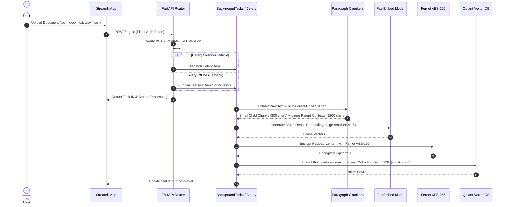
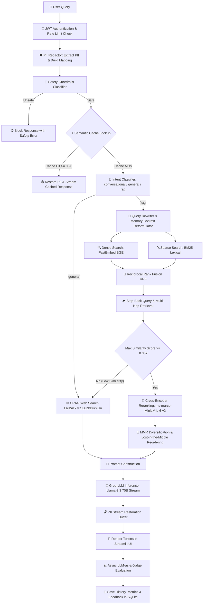
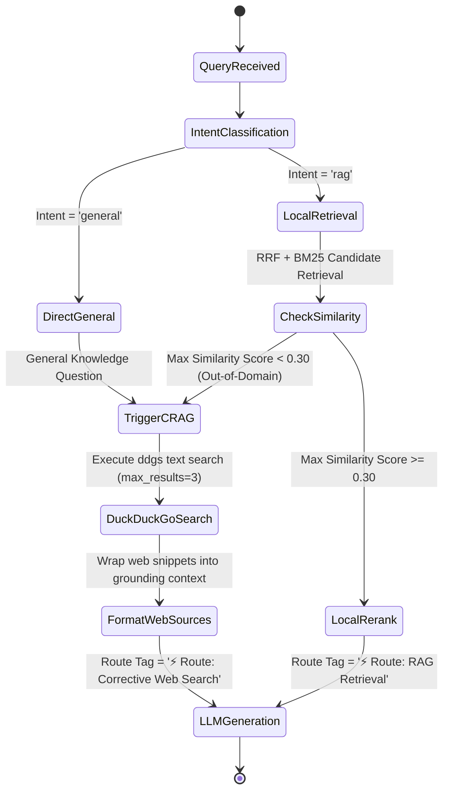
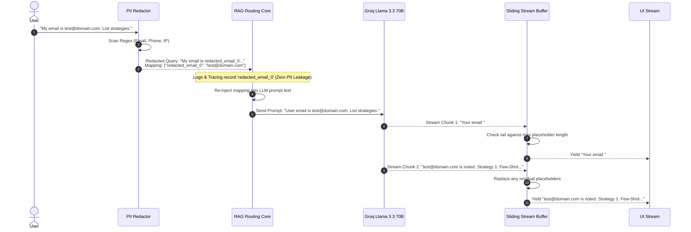

# 📘 Enterprise RAG Platform: Complete Technical Deep Dive & Tech Stack Rationale

Welcome to the beginner-to-advanced technical deep-dive guide for the **Enterprise RAG Platform**. This document explains the entire system architecture, algorithms, data flows, security mechanisms, mathematical foundations, code implementations, and **why every single technology was selected over alternatives**.

---

## 📌 Table of Contents

1. [Beginner's Guide: What is RAG & Why Do We Need It?](#1-beginners-guide-what-is-rag--why-do-we-need-it)
2. [Technology Choice Rationale Matrix ("Why Tech X over Y?")](#2-technology-choice-rationale-matrix-why-tech-x-over-y)
3. [High-Level System Architecture](#3-high-level-system-architecture)
4. [End-to-End Execution Flows & Diagrams](#4-end-to-end-execution-flows--diagrams)
   - [Document Ingestion & Indexing Pipeline](#document-ingestion--indexing-pipeline)
   - [Query Processing & Multi-Stage Retrieval Pipeline](#query-processing--multi-stage-retrieval-pipeline)
   - [Corrective RAG (CRAG) Web Search Fallback](#corrective-rag-crag-web-search-fallback)
   - [Bi-Directional PII Scrubbing & Stream Restoration](#bi-directional-pii-scrubbing--stream-restoration)
5. [Module-by-Module Code Architecture](#5-module-by-module-code-architecture)
   - [`api/` — API Gateway & Routing](#api--api-gateway--routing)
   - [`database/` — Vector & Relational Storage](#database--vector--relational-storage)
   - [`rag/` — Retrieval, Reranking & Evaluation](#rag--retrieval-reranking--evaluation)
   - [`security/` — Encryption, Guardrails & PII](#security--encryption-guardrails--pii)
   - [`app.py` — Streamlit Frontend UI](#apppy--streamlit-frontend-ui)
6. [Deep Dive: Algorithms Made Simple (With Analogies & Math)](#6-deep-dive-algorithms-made-simple-with-analogies--math)
   - [Paragraph-First & Parent-Child Chunking](#paragraph-first--parent-child-chunking)
   - [Reciprocal Rank Fusion (RRF)](#reciprocal-rank-fusion-rrf)
   - [BM25 Lexical Scoring](#bm25-lexical-scoring)
   - [Scalar Quantization (INT8) & HNSW Indexing](#scalar-quantization-int8--hnsw-indexing)
   - [Maximal Marginal Relevance (MMR)](#maximal-marginal-relevance-mmr)
   - [Cross-Encoder Reranking vs Bi-Encoders](#cross-encoder-reranking-vs-bi-encoders)
   - [Lost-in-the-Middle Chunk Re-ordering](#lost-in-the-middle-chunk-re-ordering)
   - [LLM-as-a-Judge Evaluation Metrics](#llm-as-a-judge-evaluation-metrics)
7. [Security, Multi-Tenancy & Data Privacy](#7-security-multi-tenancy--data-privacy)
8. [Observability, Telemetry & Cost Auditor](#8-observability-telemetry--cost-auditor)
9. [Production Deployment Checklist](#9-production-deployment-checklist)

---

## 1. Beginner's Guide: What is RAG & Why Do We Need It?

### 💡 Plain English Analogy
Imagine taking a **closed-book exam**. If the exam asks about proprietary company policies created yesterday, you will fail or guess (hallucinate) because your brain wasn't trained on those files.

Now imagine taking an **open-book exam**. Before answering a question, a smart assistant searches a library, finds the exact 3 pages containing the answer, places those 3 pages on your desk, and tells you: *"Answer the question using ONLY these 3 pages."* 

**That is Retrieval-Augmented Generation (RAG).**

```
+-------------------+       +--------------------+       +-------------------+
|  1. USER QUERY    | ----> | 2. RETRIEVE        | ----> | 3. GENERATE       |
| "What is our Q3   |       | Search DB & fetch  |       | LLM reads context |
|  revenue target?" |       | matching pages     |       | & returns answer  |
+-------------------+       +--------------------+       +-------------------+
```

---

## 2. Technology Choice Rationale Matrix ("Why Tech X over Y?")

When building production AI systems, picking the right tools is critical. Here is the explicit breakdown of why every core technology in this platform was chosen over popular alternatives:

| Component | Selected Technology | Alternative Considered | Why We Selected Our Choice (Detailed Rationale) |
| :--- | :--- | :--- | :--- |
| **API Framework** | **FastAPI** | Flask, Django | **FastAPI** offers native asynchronous concurrency (`async/await`), automatic OpenAPI (`/docs`) interactive documentation, and high-performance Pydantic request validation. It is up to 5x faster than Flask under heavy stream workloads. |
| **Vector DB** | **Qdrant** | Pinecone, ChromaDB, PGVector | **Qdrant** provides local file-system persistence (no cloud lock-in), built-in **INT8 Scalar Quantization** (reducing RAM by 75%), fast HNSW indexing, and payload filtering for multi-tenancy without needing a heavy database cluster. |
| **Embeddings** | **FastEmbed (`bge-small-en-v1.5`)** | OpenAI (`text-embedding-3`), HuggingFace Transformers | **FastEmbed** uses ONNX Runtime under the hood, running embeddings in CPU memory without PyTorch bloat. It computes 384-dimensional vectors in sub-10ms with **zero API costs** and zero network latency. |
| **LLM Inference** | **Groq (Llama-3.3-70B)** | OpenAI GPT-4o, Anthropic Claude | **Groq LPU (Language Processing Unit)** hardware yields stream speeds of 250–300 tokens/second for Llama-3.3-70B. It is ~$0.59 / $0.79 per million tokens (95% cheaper than GPT-4) while matching GPT-4 reasoning capability. |
| **Metadata DB** | **SQLite (WAL Mode)** | PostgreSQL, MongoDB | **SQLite** requires zero server configuration and runs in-process. In Write-Ahead Logging (WAL) mode, it handles thousands of read queries per second with sub-millisecond latency for session history, feedback, and semantic caching. |
| **Frontend UI** | **Streamlit** | React / Next.js | **Streamlit** allows rapid pure-Python UI development. It natively handles Server-Sent Events (SSE) streaming, interactive chat components, session state, and metric dashboards without JavaScript build overhead. |
| **Payload Security** | **Fernet AES-256** | Plaintext, RSA | **Fernet (AES-256-CBC + HMAC-SHA256)** provides symmetric authenticated encryption. It secures document text stored in Qdrant payloads at rest against unauthorized disk inspection, decrypting only in-memory during search. |
| **Reranker** | **Cross-Encoder (`ms-marco-MiniLM-L-6-v2`)** | Bi-Encoder Cosine only | Bi-encoders embed queries and documents separately, missing word-pair interactions. Cross-Encoders pass query and chunk together through transformer attention layers, boosting precision by up to 30%. |
| **Web Fallback** | **DuckDuckGo (`ddgs`)** | SerpAPI, Google Search API | **`ddgs`** is a free, open-source python package requiring zero API keys, zero subscription fees, and no rate-limit hurdles for retrieving real-time web search fallback context. |
| **Authentication** | **PyJWT + Bcrypt** | Session Cookies, Auth0 | **PyJWT** provides stateless token authentication ideal for API microservices, paired with **Bcrypt** for secure password hashing and complexity validation. |

---

## 3. High-Level System Architecture

The platform follows a clean 4-tier modular layer:

```
+-----------------------------------------------------------------------+
|                         Streamlit Frontend UI                         |
|   (Chat Interface, File Manager, Token Cost Auditor, Eval Dashboard)  |
+-----------------------------------------------------------------------+
                                   | HTTP REST / SSE Stream
                                   v
+-----------------------------------------------------------------------+
|                           FastAPI API Layer                           |
|  (Auth JWT, Rate Limiting, Correlation ID, Prom Metrics, Routing)     |
+-----------------------------------------------------------------------+
            |                              |                   |
            v                              v                   v
+-----------------------+     +-----------------------+     +-----------+
|    Security Layer     |     |   Core RAG Pipeline   |     | Database  |
| - AES-256 Encryption  |     | - Chunking & Embed    |     | - Qdrant  |
| - PII Redactor Shield |     | - Hybrid RRF & BM25   |     |   Vector  |
| - Input/Output Safety |     | - Cross-Encoder       |     | - SQLite  |
+-----------------------+     | - CRAG Web Fallback   |     |   Relational
                              | - LLM-as-a-Judge Eval |     +-----------+
                              +-----------------------+
```

---

## 4. End-to-End Execution Flows & Diagrams

### Document Ingestion & Indexing Pipeline



---

### Query Processing & Multi-Stage Retrieval Pipeline



---

### Corrective RAG (CRAG) Web Search Fallback



---

### Bi-Directional PII Scrubbing & Stream Restoration



---

## 5. Module-by-Module Code Architecture

### `api/` — API Gateway & Routing
- **`api/main.py`**: Entry point for FastAPI. Configures CORS middleware, mounts sub-routers, initializes Prometheus metrics, and manages lifespan startup events.
- **`api/auth.py`**: Handles user registration, password strength validation (using regex for uppercase, numbers, special characters), password hashing via `bcrypt`, and JWT token issuance/verification (`PyJWT`).
- **`api/middleware.py`**: Implements Slowapi rate limiting (`10 requests/minute` per user), correlation-ID injection for every HTTP request, and latency metrics tracking.
- **`api/routing.py`**: The core orchestration file. Contains `/chat`, `/ingest`, `/db/stats`, `/db/token_usage`, `/db/clear`, and `/chat/feedback` endpoints. Integrates multi-tenant checks, CRAG fallback logic, and SSE streaming.

### `database/` — Vector & Relational Storage
- **`database/qdrant.py`**: Establishes the Qdrant client connection (`./qdrant_db`). Defines collection parameters for `research_papers`:
  - **Vector Dimension**: `384` (matching `BAAI/bge-small-en-v1.5`)
  - **Distance Metric**: `Cosine`
  - **Scalar Quantization**: `INT8` (4x memory reduction)
  - **HNSW Index Config**: `m=16`, `ef_construct=100`
- **`database/sqlite.py`**: Manages the SQLite database (`users.db`). Contains tables:
  - `users`: Credentials, password hash, role (`admin`, `readonly`).
  - `chat_history`: Persistent session histories.
  - `feedback`: User ratings (+1 / -1) and review text.
  - `token_usage`: Prompt tokens, completion tokens, total tokens, timestamp.
  - `embedding_cache`: Hashes and cached vector blobs for FastEmbed.

### `rag/` — Retrieval, Reranking & Evaluation
- **`rag/chunking.py`**: `paragraph_first_chunking()` and `parent_child_chunking()`.
- **`rag/embedding.py`**: Lazily loads `FastEmbed` (`BAAI/bge-small-en-v1.5`) with SQLite vector caching.
- **`rag/search.py`**: Hybrid retrieval (Vector + BM25 + RRF + MMR) and semantic caching.
- **`rag/prompts.py`**: System prompt templates, intent routing, step-back expansion, HyDE, and query rewriting.
- **`rag/reranking.py`**: Local Cross-Encoder reranker (`ms-marco-MiniLM-L-6-v2`) with LLM fallback.
- **`rag/evaluation.py`**: LLM-as-a-Judge metric evaluators (Faithfulness, Relevance, Precision).

### `security/` — Encryption, Guardrails & PII
- **`security/encryption.py`**: Fernet AES-256 payload encryption at rest.
- **`security/guardrails.py`**: Safety classifier checking input/output alignment.
- **`security/pii_redactor.py`**: Regex PII scrubber supporting bi-directional mapping tuples.

### `app.py` — Streamlit Frontend UI
- Multi-page tab interface (`💬 Chat` and `📊 Evaluation Dashboard`).
- Live grounding source cards, feedback buttons, token cost auditor, and automated hallucination warning banners.

---

## 6. Deep Dive: Algorithms Made Simple (With Analogies & Math)

### Paragraph-First & Parent-Child Chunking
- **Analogy**: Imagine cutting a recipe book into individual lines vs keeping full recipes together. If you cut across a line, you get *"Add 2 tbsp of..."* without knowing what to add!
- **Paragraph-First**: Splits text at natural double-newlines `\n\n` so full thoughts stay together.
- **Parent-Child**: 
  - **Child Chunks** ($300$ chars): Small index cards used for high-precision search.
  - **Parent Chunks** ($1200$ chars): The full page passed to the LLM when a child card matches.

---

### Reciprocal Rank Fusion (RRF)
- **Analogy**: Imagine two movie critics (Vector Search & Keyword Search) ranking movies. Critic A ranks *Inception* #1. Critic B ranks *Inception* #2. RRF merges their ranking lists into a single master score without caring about their different rating scales!

$$RRF\_Score(d \in D) = \sum_{m \in M} \frac{1}{k + r_m(d)}$$

Where $k = 60$, and $r_m(d)$ is the 1-based rank of document $d$ in search system $m$.

---

### BM25 Lexical Scoring
Measures exact word match frequency adjusted for document length:

$$\text{Score}(D, Q) = \sum_{i=1}^{n} \text{IDF}(q_i) \cdot \frac{f(q_i, D) \cdot (k_1 + 1)}{f(q_i, D) + k_1 \cdot \left(1 - b + b \cdot \frac{|D|}{\text{avgdl}}\right)}$$

---

### Scalar Quantization (INT8) & HNSW Indexing
- **Analogy**: Converting a massive 4K raw image into a compressed WebP image. You save 75% file size while the human eye can't spot the difference!
- **Quantization**: Converts 32-bit float vectors (`FP32`) into 8-bit integers (`INT8`).
- **HNSW**: Builds a multi-layer graph skip-list for $O(\log N)$ nearest-neighbor search speed.

---

### Maximal Marginal Relevance (MMR)
- **Analogy**: If you ask for 3 news articles about space, MMR ensures you don't get 3 articles covering the exact same launch details.

$$\text{MMR} = \arg\max_{d_i \in R \setminus S} \left[ \lambda \cdot \text{Sim}_1(d_i, Q) - (1 - \lambda) \max_{d_j \in S} \text{Sim}_2(d_i, d_j) \right]$$

Setting $\lambda = 0.7$ balances query relevance with context diversity.

---

### Cross-Encoder Reranking vs Bi-Encoders
- **Bi-Encoder**: Compares query vector and chunk vector independently via dot product ($<5\text{ms}$).
- **Cross-Encoder**: Feeds query AND chunk together into a joint attention transformer ($~50\text{ms}$). High accuracy.

Our pipeline uses Bi-Encoder + BM25 for top-20 candidate retrieval, and Cross-Encoder to rerank down to top-3.

---

### Lost-in-the-Middle Chunk Re-ordering
- **Analogy**: When reading a long grocery list, you remember the first item ("Milk") and the last item ("Eggs"), but forget the item in the middle ("Butter").

Given top reranked chunks $[C_1, C_2, C_3, C_4, C_5]$:
- Reordered context sent to LLM: $[C_1, C_3, C_5, C_4, C_2]$.

---

### LLM-as-a-Judge Evaluation Metrics

1. **Faithfulness**:
   $$\text{Faithfulness} = \frac{\text{Supported Claims in Answer}}{\text{Total Claims in Answer}}$$
   *(If score $< 0.70$, Streamlit displays an automated Hallucination Warning Banner).*

2. **Answer Relevance**: Cosine similarity between original query vector and a query regenerated from the LLM response.

3. **Context Precision**: Evaluates whether relevant chunks were ranked higher than irrelevant chunks in the context list.

---

## 7. Security, Multi-Tenancy & Data Privacy

- **Data Isolation**: Multi-tenancy payload filter `user_id == username` in Qdrant ensures zero cross-tenant data visibility.
- **Fernet AES-256 Encryption at Rest**: Encrypts document chunk payloads at rest in Qdrant; decrypts in-memory only during search.
- **Bi-Directional PII Scrubbing**: Redacts sensitive emails, phones, and IPs before logging/tracing, while dynamically restoring values in LLM prompt generation and output token streaming.

---

## 8. Observability, Telemetry & Cost Auditor

- **Prometheus `/metrics`**: Counters and latency histograms for API health monitoring.
- **Arize Phoenix Tracing (`http://localhost:6006`)**: OpenTelemetry visualization for retrieval, reranking, and generation spans.
- **Token Cost Auditor**: Tracks prompt/completion tokens and calculates real-time USD costs based on Llama-3.3-70B pricing ($0.59 / $0.79 per million tokens).

---

## 9. Production Deployment Checklist

- [x] Set 64-character JWT `SECRET_KEY` in `.env`.
- [x] Persist `./qdrant_db` on SSD storage.
- [x] Enable SQLite WAL mode (`PRAGMA journal_mode=WAL;`).
- [x] Deploy behind Nginx reverse proxy with TLS HTTPS.
- [x] Run Celery Redis workers (`celery -A tasks worker --loglevel=info`) for asynchronous document processing.
